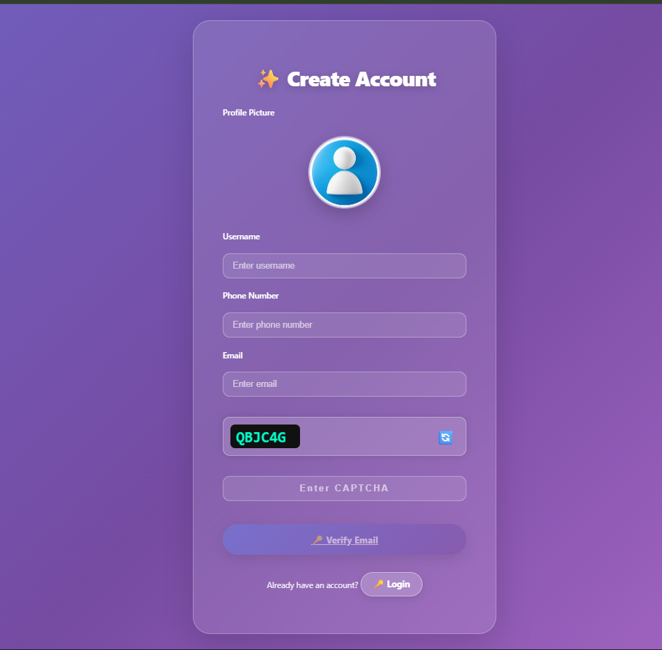
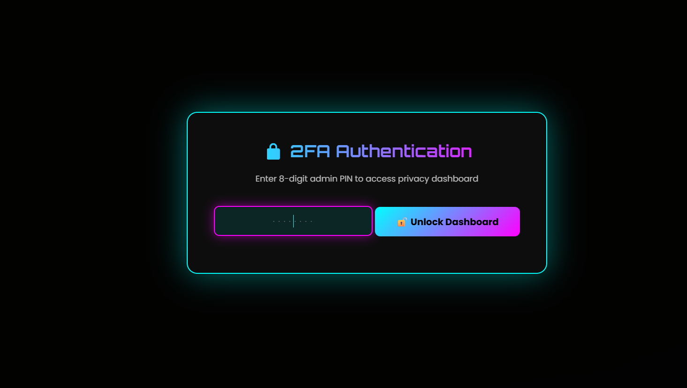
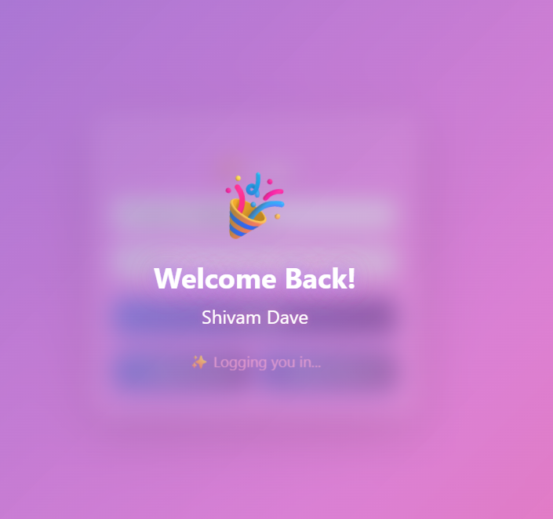

<!-- 🔥 TOP BANNER -->
<p align="center">
  
</p>

<h1 align="center">☁️ Cloud-Space</h1>

<!-- 🔥 Typing Animation -->
<p align="center">
  
</p>

<!-- 🔥 Badges -->
<p align="center">
  
  
  
  
</p>

<!-- 🔥 Links -->
<p align="center">
  <a href="https://shivamdave0704.github.io/Cloud-Space/public/"><b>🌐 Live Demo</b></a> •
  <a href="https://github.com/ShivamDave0704/Cloud-Space"><b>📂 Repository</b></a>
</p>

---

## 🚀 Overview

Cloud-Space is a **modern full-stack cloud storage system** that allows users to upload, manage, and access files securely.  
Built with performance, scalability, and security in mind.

---

## ✨ Features

- 🔐 Authentication (Login / Signup / 2FA)
- 📁 File Upload & Download
- ☁️ Cloud Storage System
- ⚡ Fast Backend (Node.js)
- 🛡️ Secure Data Handling
- 📱 Responsive UI

---

## 🛠️ Tech Stack

- **Frontend:** HTML, CSS, JavaScript  
- **Backend:** Node.js, Express.js  
- **Database:** MongoDB  

---

## 📸 Preview

### 🔐 Authentication

<p align="center">
  
  
  
</p>

---

### ✨ Animations

<p align="center">
  
</p>

<p align="center">
  
</p>

---

### 📩 Email Verification

<p align="center">
  
</p>

---

### ☁️ Features

<p align="center">
  
</p>

<p align="center">
  
</p>

---

## ⚙️ Installation

```bash
git clone https://github.com/ShivamDave0704/Cloud-Space.git
cd Cloud-Space
npm install
```

▶️ Run Project

```bash
npm start
```

🌐 Live Demo

👉 https://shivamdave0704.github.io/Cloud-Space/public/

📊 GitHub Stats

<p align="center">  </p>

🌟 Future Enhancements

- 📦 File Sharing System
- 🧠 AI File Search
- 🔒 End-to-End Encryption
- 📊 Storage Analytics

👨‍💻 Developer

Shivam Dave
🔗 https://github.com/ShivamDave0704

<!-- 🔥 FOOTER -->
<p align="center">  
</p>
